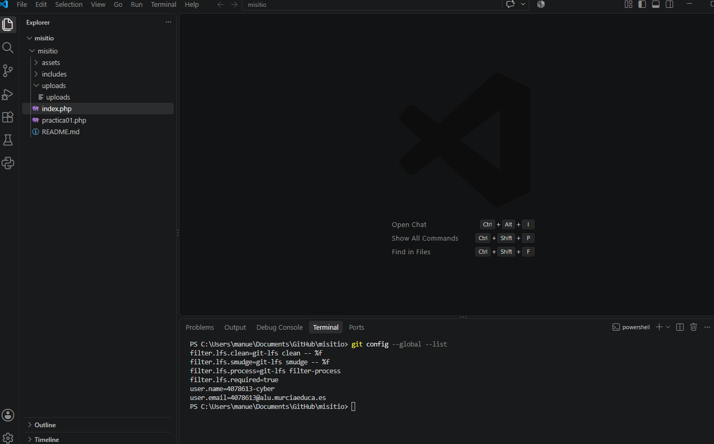
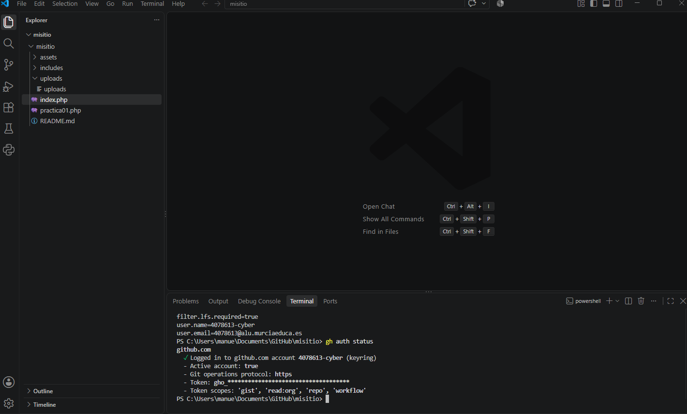
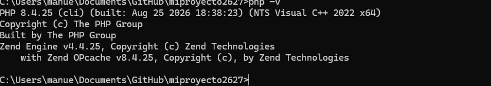
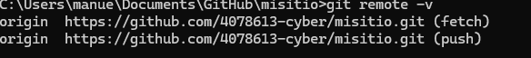
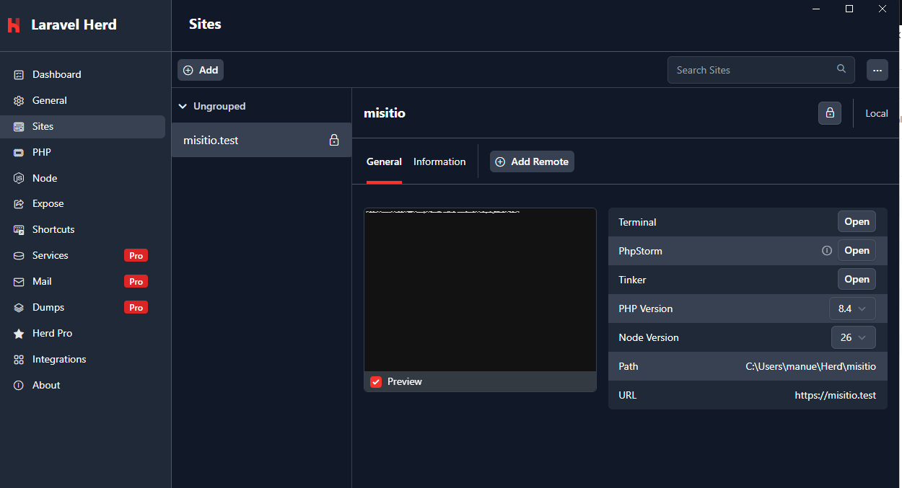

# Instalación y configuración local con ProperDocs

## 1. Configuración de Git

Verifiqué la configuración global de Git desde la terminal de VS Code:

```bash
git config --global --list
```



## 2. Autenticación en GitHub CLI

Instalé GitHub CLI y comprobé el estado de la autenticación:

```bash
gh auth status
```



## 3. Herd con PHP 8.4

Instalé Herd y seleccioné PHP 8.4 para el entorno local.



## 4. Repositorio clonado

Cloné el repositorio `misitio` y comprobé la configuración del remoto:

```bash
git remote -v
```



## 5. Sitio local servido con HTTPS

Enlacé la carpeta `misitio` con Herd y verifiqué que el sitio se sirviera mediante HTTPS.



## Resumen de Read the Docs

El documento utiliza títulos, texto, bloques de código e imágenes en Markdown. Read the Docs proporciona el tema y la navegación para organizar la documentación. No se requieren plugins adicionales para este contenido.
```
